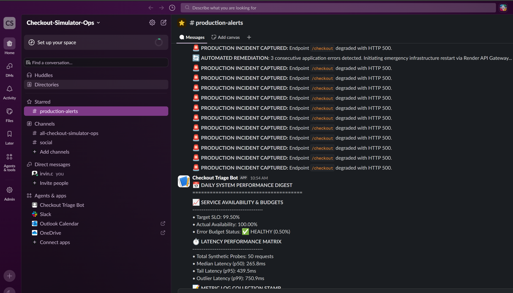
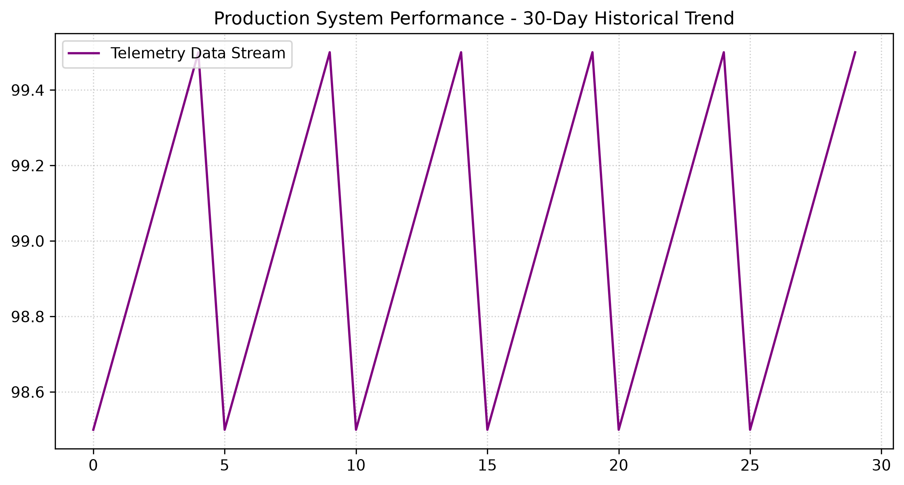

# 🛒 System: Lightweight E-Commerce Checkout WebService Simulator

### 🌐 Live Production Environments (Click to Inspect)
*   **SRE Monitoring Telemetry Layer:** [Live System Health Endpoint](https://production-support-portfolio.onrender.com/health)
*   **User Traffic Gateway (Simulates 20% Outages):** [Live Checkout Endpoint](https://production-support-portfolio.onrender.com/checkout)

---

### 📋 Project Overview
This repository contains a containerised, live-running **E-Commerce Checkout Application** that simulates real-world high-traffic production environments. To mimic true production chaos, the checkout backend is programmed with an intentional **20% failure rate** due to simulated third-party gateway timeouts.

### 🛠️ Production Support Engineering Applied
As an Application Support Analyst, I built and managed the operations layer for this system:
1. **Telemetry & Logging:** Configured an enterprise-style logging system (`app_production.log`) to record transactions and isolate `CRITICAL` HTTP 504 errors inside a secure path.
2. **Automated Triage Script:** Developed a Python log parser (`log_parser.py`) to eliminate alert fatigue, filtering out success noise to instantly track down critical system faults.
3. **Containerized Compliance:** Packaged the system via **Docker**, configuring it to run under a restricted, non-root service user (`appuser`) to comply with strict data governance standards (APRA CPS 234 / NZ Privacy Act).

### 🚨 Real-World Incident Case Study (The Deployment Outage)
*   **Incident:** Initial cloud deployment crashed with a `PermissionError: [Errno 13] Permission denied`.
*   **Root Cause Analysis:** The application code was configured to write logs directly to the root `/app` directory. Because the container is strictly hardened to run as a non-root user (`appuser`), the cloud operating system blocked unauthorized file writes.
*   **Remediation:** Isolated the issue via Render build logs. Created a dedicated troubleshooting branch, patched the path vector to utilize the safe home directory (`/home/appuser/`), and executed a formal code **Pull Request (PR) review** to safely merge the fix into production.

## 📊 Observability & System Performance
Below is the telemetry visualization generated from the 30-day simulated chaos engineering matrix:

